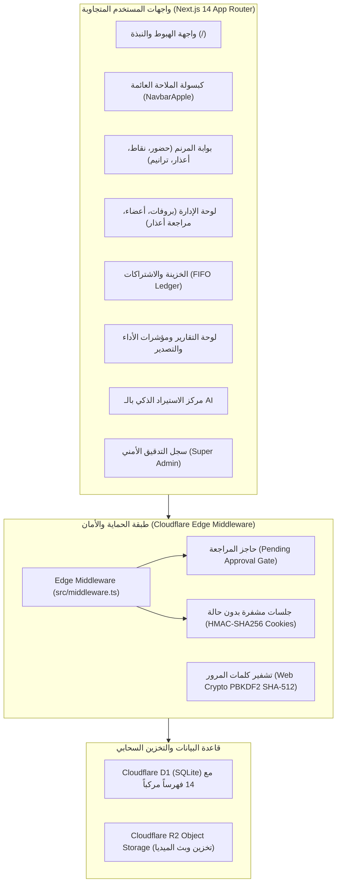

<div align="center">

# ⛪ كورال ثمر شفاه — مطرانية سوهاج
### Thamar Shefah Choir Management System
**ذبيحة تسبيح • منذ عام 2000 | Sacrifice of Praise • Since 2000**

[](https://nextjs.org/)
[](https://www.typescriptlang.org/)
[](https://tailwindcss.com/)
[](https://developers.cloudflare.com/d1/)
[](https://developers.cloudflare.com/r2/)
[](https://developer.mozilla.org/en-US/docs/Web/API/Web_Crypto_API)

<p align="center">
  منظومة كنسية سحابية متطورة لإدارة كورال <strong>ثمر شفاه</strong> بمطرانية السيدة العذراء مريم بسوهاج.<br/>
  تجمع بين تسجيل الحضور الجغرافي بالـ GPS، محفظة النقاط والمكافآت، الخزينة والاشتراكات بنظام FIFO، أرشيف الترانيم والنوت الموسيقية، ولوحة التقارير والتحليلات بالذكاء الاصطناعي بتكلفة سحابية <strong>$0</strong> على باقة Cloudflare المجانية.
</p>

[استعراض المميزات](#-أبرز-مميزات-المنظومة) • [الهيكل التقني](#-المعمارية-التقنية) • [الأدوار والصلاحيات](#-أدوار-وصلاحيات-النظام) • [طريقة التشغيل](#-دليل-التثبيت-والتشغيل-المحلي) • [النشر السحابي](#-النشر-السحابي-cloudflare)

---

</div>

## 🎨 الهوية البصرية الرسمية (Royal Liturgical Theme)

تم استخراج لوحة الألوان بدقة متناهية من شعار الكورال الرسمي لتحقيق هوية كنسية ملكية راقية وفق معايير `ui-ux-pro-max`:

| اللون | كود اللون (Hex) | الوصف والاستخدام في النظام |
|---|---|---|
| **الأحمر الملكي (Burgundy)** | `#640810` | لون الخط القبطي والعربي والشعار، الأزرار الأساسية، والعناوين البارزة. |
| **الذهب المتألق (Radiant Gold)** | `#DCA40C` | الصليب وأوتار القيثارة، مؤشرات الـ KPIs، وحلقات التركيز والوسوم. |
| **الخلفية العاجية (Warm Ivory)** | `#FDFBF7` | السطح العام المريح للعين في القراءة والاستخدام المطول في الكنيسة. |
| **أسطح البطاقات (Card Surface)** | `#FFFFFF` | بطاقات زجاجية Apple Glass مع حدود ذهبية خفيفة `#EADBB6`. |

---

## 🌟 أبرز مميزات المنظومة

### 1. 🧭 كبسولة الملاحة العائمة (Apple Dynamic Island Navbar)
- شريط تنقل علوي زجاجي عائم يرافق المستخدم في **كل صفحات السيستم**.
- **نظام رجوع ذكي تلقائي (Computed Back URL):** يحدد أوتوماتيكياً الوجهة الصحيحة للرجوع بنقرة واحدة دون أن يتوه المستخدم.
- محول فوري ثنائي اللغة بالكامل (**العربية RTL** $\leftrightarrow$ **الإنجليزية LTR**).

### 2. 📍 محرك الحضور بالـ GPS مع التحقق السيرفري (Haversine Geofencing)
- حساب المسافة بين هاتف المرنم وقاعة الكورال كروياً عبر السيرفر:
  $$\text{distance} = 2r \arcsin\left(\sqrt{\sin^2\left(\frac{\Delta \phi}{2}\right) + \cos(\phi_1)\cos(\phi_2)\sin^2\left(\frac{\Delta \lambda}{2}\right)}\right)$$
- رفض أي محاولة لتسجيل الحضور خارج النطاق الجغرافي المسموح (100 متر) أو خارج النوافذ الزمنية المحددة للبروفة.
- تصنيف الوصول تلقائياً:
  - `PRESENT` (حاضر في ميعادك 🟢)
  - `LATE` (متأخر 🟡)
  - `VERY_LATE` (تأخير كبير 🟠)
  - `EXTREME_LATE` (تأخير حرج 🔴)
  - `ABSENT` (غياب بدون عذر)

### 3. 📨 منظومة تقديم ومراجعة الأعذار
- تقديم الأعذار مباشرة من هاتف المرنم (عذر غياب كامل أو عذر تأخير زمني محدد).
- صندوق وارد إداري للمراجعة والاعتماد الفوري، مع تحويل البروفات المعتمدة تلقائياً إلى `EXCUSED_ABSENCE` وإلغاء خصم الغياب.

### 4. 🏆 محرك لائحة النقاط والمحفظة الرقمية
- قواعد نقاط تصاعدية وشرائح حسب تكرار الحالة داخل الربع السنوي (Quarters).
- محفظة رقمية لكل مرنم توضح رصيد نقاطه، ونظام تسويات ومكافآت يدوية موثقة للمشرفين.

### 5. 💰 الخزينة والاشتراكات بنظام التوزيع المتتالي (Deterministic FIFO)
- توليد المطالبات الشهرية حسب فئات المرنمين (`STUDENT` 30 ج، `WORKING` 50 ج).
- سداد أقدم شهر متأخر أولاً بشكل قطعي وآلي (FIFO) لضمان عدم تراكم المتأخرات وحماية حقوق الخزينة.
- دفتر مالي كامل مع صلاحيات إعفاء الاشتراكات للمشرفين.

### 6. 🎼 أرشيف الترانيم والنوت الموسيقية (Cloudflare R2 Media)
- دعم كامل لحفظ ورفع الترانيم بـ **امتداداتها الأصلية** (`.mp3`, `.wav`, `.m4a`, `.aac`, `.flac`, `.pdf`, إلخ).
- مشغل صوتي متقدم للبروفات يدعم التقطيع الجزئي (`HTTP 206 Partial Content`) لسرعة التقديم والتأخير دون استهلاك باقة الإنترنت.
- التحكم في سرعة العرض (`0.75x`, `1.0x`, `1.25x`)، عارض النوت الموسيقية PDF، وتوجيهات الهارموني للأصوات الأربعة (سوبرانو، ألتو، تينور، باص).
- دعم المناسبات الطقسية وإضافة قسم **"كنتاتا"** الجديد.

### 7. 📊 لوحة التحليلات ومؤشرات الأداء (Advanced KPIs & Reports)
- **مؤشرات الأداء الجماعي (Collective KPIs):** مؤشر صحة الكورال الكلي (/100)، معدل الحضور العام، مؤشر الانضباط الزمني، تكافؤ وتوازن الأصوات، ونسب التحصيل المالي.
- **تقييم الأداء الفردي (Individual KPIs):** أطول سلسلة التزام متواصلة (Streak 🔥)، ترتيب المرنم في قسمه الصوتي، وشرائح التقييم الشامل (نخبوي 🌟، ملتزم جداً 🟢، مستقر 🟡، يحتاج متابعة 🟠، حرج 🔴).
- **كارت التقييم الفردي للمرنم:** بطاقة أداء تفاعلية يمكن تصديرها لكل مرنم على حدة.

### 8. 📄 محرك تصدير التقارير متعدد الصيغ (Word, Excel, PDF)
- **Excel (`.xlsx`):** شيت مفصل بـ 3 صفحات للمؤشرات الجماعية، كشف تقييم الأعضاء، وتحليل الأصوات.
- **Word (`.doc`/`.docx`):** تقرير كنسي رسمي منسق بالترويسة الملكية وخانات توقيع الأب الكاهن والمايسترو وأمين الخدمة.
- **PDF والطباعة:** جاهز للطباعة المباشرة من المتصفح بجودة عالية.

### 9. 🤖 المعالجة والجدولة الذكية بالذكاء الاصطناعي (AI File Ingestion)
- سحب وإفلات ملفات Word أو Excel أو PDF أو نصوص.
- محرك ذكاء اصطناعي (Gemini 1.5 + محرك استدلالي عربي محلي) يستخرج ويصنف آلياً:
  - 👥 الأعضاء وأرقامهم وأقسامهم الصوتية.
  - 📅 البروفات وتواريخها ومواعيدها.
  - 🎵 الترانيم والكلمات والمناسبات.
  - 💰 الاشتراكات والمدفوعات.
- شاشة معاينة تفاعلية مع الاعتماد والجدولة في السيستم بضغطة واحدة (**1-Click Commit**).

### 10. 🛡️ سجل التدقيق الأمني المشدد (Super Admin Audit Trail)
- حماية أمنية مشددة على مسار `/admin/super/*` للمشرف العام فقط.
- توثيق غير قابل للتعديل لكافة العمليات الإدارية، الحركات المالية، وتسجيل الحضور.
- فاحص الفروقات المتقدم (**Side-by-side JSON Diff Inspector**) مع تصدير السجل بصيغة CSV.

---

## 🏗️ المعمارية التقنية



---

## 👥 أدوار وصلاحيات النظام (RBAC)

| الرتبة | الرمز البرمجي | الصلاحيات والمسؤوليات |
|---|---|---|
| **مرنم / عضو** | `MEMBER` | تسجيل الحضور بالـ GPS، استعراض محفظة النقاط، تقديم طلبات الأعذار، الاستماع للترانيم والنوت، ومتابعة سجل الاشتراكات. |
| **خادم إداري** | `ADMIN` | جدولة البروفات وتحديد النطاق الجغرافي، مراجعة واعتماد طلبات الأعذار، اعتماد الأعضاء الجدد، ضبط قواعد ولائحة النقاط، رفع وإدارة الترانيم، واستعراض التقارير ومؤشرات الأداء. |
| **أمين الخزينة** | `SUBSCRIPTION_MANAGER` | متابعة كشوفات اشتراكات الأعضاء، تسجيل الدفعات المالية وتوزيعها بنظام FIFO، وإصدار التقارير المالية. |
| **المشرف العام** | `SUPER_ADMIN` | أعلى سلطة في المنظومة: منح وإلغاء رتب الإدارة، إعفاء الاشتراكات، الاطلاع على سجل التدقيق الأمني وفاحص الفروقات (Diff Inspector)، وتصدير الأرشيف الأمني. |

---

## 🗺️ خريطة المراحل الـ 10 للمشروع

- [x] **المرحلة 1:** واجهة الهبوط، الهوية البصرية، ومحاكي الحضور.
- [x] **المرحلة 2:** نظام المصادقة المشدد، التشفير بـ PBKDF2، وحاجز اعتماد العضوية.
- [x] **المرحلة 3:** إدارة الأرباع السنوية وسجل ودليل الأعضاء.
- [x] **المرحلة 4:** محرك الحضور الجغرافي بالـ GPS ومعادلة Haversine وتصنيف الوصول.
- [x] **المرحلة 5:** منظومة تقديم ومراجعة الأعذار وتحديث سجلات الغياب.
- [x] **المرحلة 6:** لائحة النقاط التراكمية، المحفظة الرقمية، والتسويات اليدوية.
- [x] **المرحلة 7:** الاشتراكات الشهرية، سداد FIFO، وإدارة الخزينة والديون.
- [x] **المرحلة 8:** أرشيف الترانيم، مشغل البروفات الصوتي السريع، وبث Cloudflare R2 بالامتدادات الأصلية.
- [x] **المرحلة 9:** لوحة التقارير والـ KPIs، تصدير Word/Excel/PDF، المعالجة الذكية بالـ AI، وسجل التدقيق الأمني.
- [ ] **المرحلة 10:** التدقيق اللغوي الكنسي النهائي، اختبارات مسار المستخدم الشاملة (E2E)، والنشر السحابي على Cloudflare.

---

## 💻 دليل التثبيت والتشغيل المحلي

### 1. المتطلبات الأساسية
- تثبيت [Node.js](https://nodejs.org/) (الإصدار 18 أو أحدث).
- مدير الحزم `npm`.

### 2. استنساخ المستودع وتثبيت الحزم
```bash
# تثبيت الحزم والمكتبات
npm install
```

### 3. إعداد متغيرات البيئة (اختياري للتطوير المحلي)
أنشئ ملف `.env.local` في المجلد الرئيسي (المشروع يعمل تلقائياً بقيم افتراضية للتطوير):
```env
# رابط قاعدة البيانات المحلية (SQLite)
DATABASE_URL="file:local.db"

# مفتاح سري لتوقيع الجلسات المشفرة
SESSION_SECRET="thamar-shefah-sacred-choir-2000-secret-key"

# مفتاح Google Gemini للذكاء الاصطناعي (اختياري، يتوفر محرك محلي بديل)
GEMINI_API_KEY=""
```

### 4. تشغيل خادم التطوير
```bash
npm run dev
```
افتح المتصفح على: **`http://localhost:3000`**

### 🔑 بيانات حساب المشرف العام المدمج للتجربة:
- **البريد الإلكتروني:** `admin@thamar-shefah.org`
- **كلمة المرور:** `Admin123456!`
*(يمتلك كافة الصلاحيات الأربعة بما فيها صلاحيات المشرف العام والخزينة).*

---

## ☁️ النشر السحابي (Cloudflare Deployment)

تم تصميم النظام ليعمل بنسبة 100% داخل حدود الباقة المجانية لـ Cloudflare ($0 Cloud Cost):
1. **Cloudflare D1:** قاعدة بيانات موزعة عالمياً (حتى 5 ملايين قراءة مجانية يومياً).
2. **Cloudflare R2:** تخزين الملفات الصوتية والنوت بدون أي رسوم لنقل البيانات (Zero Egress Fees).
3. **Cloudflare Pages / Workers:** تشغيل واجهات Next.js على الحافة السحابية (Edge) بأعلى سرعة استجابة في مصر والشرق الأوسط.

للرفع على Cloudflare:
```bash
# تسجيل الدخول لحساب Cloudflare
npx wrangler login

# تطبيق ترحيل قاعدة البيانات على D1
npx wrangler d1 migrations apply thamar-shefah-db --remote

# نشر المشروع بالكامل
npm run build
npx wrangler deploy
```

---

<div align="center">

**صلوا من أجل خدمة كورال ثمر شفاه**<br/>
*كنيسة السيدة العذراء مريم — مطرانية سوهاج*

</div>
