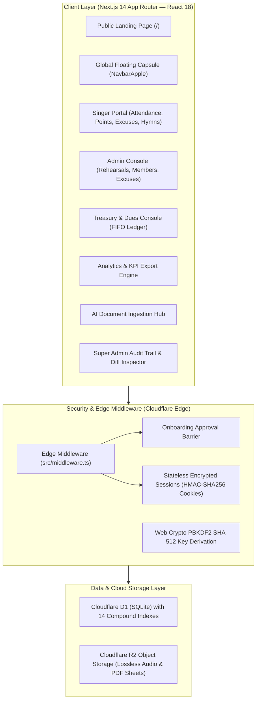

<div align="center">

# ⛪ Thamar Shefah Choir Management System
### Coptic Orthodox Diocese of Sohag — St.George Church
**Sacrifice of Praise • Serving Since 2000 | ذبيحة تسبيح • منذ عام 2000**

[](https://nextjs.org/)
[](https://www.typescriptlang.org/)
[](https://tailwindcss.com/)
[](https://developers.cloudflare.com/d1/)
[](https://developers.cloudflare.com/r2/)
[](https://developer.mozilla.org/en-US/docs/Web/API/Web_Crypto_API)

<p align="center">
  A state-of-the-art, edge-native ecclesiastical management ecosystem built for <strong>Thamar Shefah Choir</strong> at the Diocese of the Virgin Mary in Sohag.<br/>
  Combines server-authoritative GPS attendance, a transactional points wallet, deterministic FIFO treasury, sacred hymn library with lossless R2 audio streaming, AI-powered document ingestion, and executive KPI analytics — operating at <strong>$0/month cloud cost</strong> on the Cloudflare Free Tier.
</p>

[Key Features](#-key-features) • [Technical Architecture](#-technical-architecture) • [Roles & Permissions](#-roles--permissions-rbac) • [Project Roadmap](#-10-phase-project-roadmap) • [Local Setup](#-installation--local-setup) • [Cloud Deployment](#-cloudflare-edge-deployment)

---

</div>

## 🎨 Visual Identity & Design System (Royal Liturgical Theme)

The color palette is derived directly from the official choir seal, following strict `ui-ux-pro-max` guidelines for solemnity, contrast, and visual hierarchy:

| Color | Hex Code | Role & Application in System |
|---|---|---|
| **Imperial Burgundy** | `#640810` | Coptic calligraphy, cross emblem, primary action buttons, brand accents, and headers. |
| **Radiant Gold** | `#DCA40C` | Harp strings, KPI rings, active indicators, focus halos, and status badges. |
| **Warm Ivory** | `#FDFBF7` | Ergonomic canvas background optimized for prolonged readability in low-light sanctuary settings. |
| **Card Surface** | `#FFFFFF` | Frosted glass cards (`backdrop-blur-md`) with subtle warm gold borders (`#EADBB6`). |

---

## 🌟 Key Features

### 1. 🧭 Apple Dynamic Island Floating Navigation Capsule
- Globally anchored floating navigation capsule present across **every route** in the application.
- **Computed Back Navigation:** Intelligently derives the natural parent URL with a single click, eliminating dead ends or circular loops.
- Instant bilingual toggle between **Arabic (RTL)** and **English (LTR)** with zero layout shift.
- Context-sensitive shortcuts adapting dynamically to the user's role and route.

### 2. 📍 Server-Authoritative Haversine GPS Geofencing
- Evaluates spherical distance between member coordinates and church premises exclusively on the server:
  $$\text{distance} = 2r \arcsin\left(\sqrt{\sin^2\left(\frac{\Delta \phi}{2}\right) + \cos(\phi_1)\cos(\phi_2)\sin^2\left(\frac{\Delta \lambda}{2}\right)}\right)$$
- Strict **100-meter radius boundary check** with anti-spoofing verification and strict time-window enforcement.
- Automated multi-tier arrival classification:
  - `PRESENT` (On-time arrival 🟢)
  - `LATE` (Standard delay 🟡)
  - `VERY_LATE` (Significant delay 🟠)
  - `EXTREME_LATE` (Critical delay 🔴)
  - `ABSENT` (Unexcused absence)

### 3. 📨 Digital Excuse Management & Admin Inbox
- Direct mobile submission for full absences or specific arrival delay windows with mandatory justifications.
- Real-time administrative triage inbox allowing conductors to approve or reject requests.
- Approved excuses automatically update rehearsal records to `EXCUSED_ABSENCE` and waive deduction penalties.

### 4. 🏆 Cumulative Points Ledger & Digital Member Wallet
- Occurrence-based escalating penalty rules evaluated per quarter (e.g., first late arrival = -1 pt, second = -2 pts, unexcused absence = -5 pts).
- Real-time digital points balance for each singer with an immutable audit ledger.
- Dedicated supervisor interface for documented manual point awards, bonuses, and disciplinary adjustments.

### 5. 💰 Deterministic FIFO Dues & Subscriptions Treasury
- Automated recurring monthly dues generation segmented by member category (`STUDENT`: 30 EGP, `WORKING`: 50 EGP).
- **Deterministic First-In, First-Out (FIFO) debt retirement:** Incoming payments automatically clear the oldest outstanding dues first, preventing delinquency debt build-up.
- Comprehensive collection roster, payment waiver controls, and real-time cash flow monitoring.

### 6. 🎼 Sacred Hymn Library & Lossless Cloudflare R2 Streaming
- Preserves **original file extensions** (`.mp3`, `.wav`, `.m4a`, `.aac`, `.flac`, `.pdf`, etc.) during upload and playback.
- Edge audio streaming engine with full `HTTP 206 Partial Content` support for instant seeking without bandwidth waste.
- Multi-speed playback controls (`0.75x`, `1.0x`, `1.25x`), embedded PDF sheet music viewer, and four-part harmony guides (Soprano, Alto, Tenor, Bass).
- Full categorization by liturgical season, feast, and the newly added **"Cantata" (كنتاتا)** section.

### 7. 📊 Executive Analytics & Multi-Level KPIs
- **Collective Choir Health Metric (Score /100):** Real-time aggregation of attendance discipline, promptness, SATB vocal balance, and treasury collection ratios.
- **Individual Performance Metrics:** Longest active commitment streak (🔥), vocal section rank, and tier badges (*Elite* 🌟, *Exemplary* 🟢, *Consistent* 🟡, *Needs Attention* 🟠, *At Risk* 🔴).
- **Interactive Singer Report Cards:** High-fidelity individual progress reports ready for direct digital delivery or export.

### 8. 📄 Multi-Format Report Export Engine (Word, Excel, PDF)
- **Excel (`.xlsx`):** Multi-tab workbook including executive KPI overviews, full member performance tables, and vocal section balance breakdowns.
- **Word (`.docx`):** Formatted official ecclesiastical document with choir letterhead, metric summary cards, and formal signature blocks for the Parish Priest, Maestro, and General Supervisor.
- **Print & PDF:** Browser-native high-resolution print styles with clean margins and pagination.

### 9. 🤖 AI-Powered Document Ingestion (AI File Ingestion Hub)
- Upload rosters, schedules, and hymn sheets in `.xlsx`, `.xls`, `.docx`, or `.pdf` format.
- Hybrid ingestion engine (Google Gemini 1.5 with an offline Arabic linguistic heuristic fallback) that automatically parses and maps:
  - 👥 Members, phone numbers, and vocal sections.
  - 📅 Rehearsal dates, start times, and grace periods.
  - 🎵 Hymns, liturgical categories, lyrics, and metadata.
  - 💰 Subscription dues and payment histories.
- Interactive diff preview allowing administrative review before executing a **1-Click Batch Commit**.

### 10. 🛡️ Strict Super Admin Security Audit Trail
- Route-level security barrier on `/admin/super/*` restricted exclusively to `SUPER_ADMIN`.
- Append-only, tamper-evident audit logging for all administrative modifications, financial transactions, and attendance overrides.
- **Side-by-side JSON Diff Inspector** visualizing before-and-after states, with full audit trail CSV export.

---

## 🏗️ Technical Architecture



---

## 👥 Roles & Permissions (RBAC)

| Role | System Identifier | Permissions & Scope |
|---|---|---|
| **Choir Member** | `MEMBER` | GPS rehearsal check-in, personal points wallet, excuse submission, hymn playback & sheet music viewing, dues payment ledger. |
| **Admin / Servant** | `ADMIN` | Rehearsal scheduling & geofence configuration, excuse review & approval, member approval, points rule calibration, hymn uploads, analytics & exports. |
| **Treasury Officer** | `SUBSCRIPTION_MANAGER` | Monthly dues generation, cash collection logging, FIFO payment distribution, dues waiver administration, and financial reporting. |
| **Super Admin** | `SUPER_ADMIN` | Supreme authority: Role assignment & revocation, global subscription waivers, immutable security audit trail inspection (JSON Diff), and CSV security exports. |

---

## 🗺️ 10-Phase Project Roadmap

- [x] **Phase 1: Foundation & Visual Identity** — Apple design tokens, landing page, interactive attendance simulator.
- [x] **Phase 2: Authentication & Onboarding** — Edge PBKDF2 SHA-512 hashing, RBAC, approval onboarding barrier.
- [x] **Phase 3: Quarters & Directory** — Annual quarter management, member directory, and vocal section allocation.
- [x] **Phase 4: GPS Attendance Engine** — Server Haversine verification, geofencing, and multi-tier arrival classifications.
- [x] **Phase 5: Digital Excuses** — Singer excuse submissions, precedence evaluation, and conductor review inbox.
- [x] **Phase 6: Points Ledger & Wallet** — Dynamic rule engine, quarterly occurrence tiers, and audited manual adjustments.
- [x] **Phase 7: Treasury & Subscriptions** — Monthly dues generator, deterministic FIFO debt payoff, and financial reports.
- [x] **Phase 8: Sacred Hymn Library & Media** — Lossless Cloudflare R2 audio streaming, original extensions, and PDF sheet viewer.
- [x] **Phase 9: Analytics, AI Ingestion & Audit** — Executive KPIs, multi-format Word/Excel/PDF exports, AI file ingestion, and Super Admin audit log.
- [ ] **Phase 10: Production Verification & Launch** — Liturgical terminology audit, full end-to-end integration tests, and Cloudflare production deployment.

---

## 💻 Installation & Local Setup

### 1. Prerequisites
- [Node.js](https://nodejs.org/) (v18.17+ or v20+ recommended).
- `npm` (v9+).

### 2. Clone Repository & Install Dependencies
```bash
git clone https://github.com/FadyAmgadNaoum/ThamarShefahChoir.git
cd ThamarShefahChoir
npm install
```

### 3. Environment Configuration (Optional for Local Dev)
The application works out-of-the-box with built-in development defaults. To customize, create a `.env.local` file:
```env
# Local SQLite database path
DATABASE_URL="file:local.db"

# Secret key used for signing HMAC-SHA256 session cookies
SESSION_SECRET="thamar-shefah-sacred-choir-2000-secret-key"

# Google Gemini API key (optional: system includes an offline heuristic fallback)
GEMINI_API_KEY=""
```

### 4. Run Development Server
```bash
npm run dev
```
Navigate to **`http://localhost:3000`** in your browser.

### 🔑 Built-in Demo Credentials:
- **Email:** `admin@thamar-shefah.org`
- **Password:** `Admin123456!`
*(Equipped with all four roles: Member, Admin, Treasury Officer, and Super Admin).*

---

## ☁️ Cloudflare Edge Deployment

The entire architecture is strictly optimized to run within the **Cloudflare Free Tier ($0/month cloud cost)**:
1. **Cloudflare D1:** Globally distributed serverless SQLite database (up to 5 million read requests/day free).
2. **Cloudflare R2:** High-performance object storage with **Zero Egress Fees** for all audio and sheet music files.
3. **Cloudflare Pages / Workers:** Runs Next.js SSR at the edge with ultra-low latency across Egypt and the Middle East.

### Deployment Commands:
```bash
# 1. Authenticate with Cloudflare
npx wrangler login

# 2. Apply database migrations to remote D1
npx wrangler d1 migrations apply thamar-shefah-db --remote

# 3. Build and deploy
npm run build
npx wrangler deploy
```

---

<div align="center">

**"I will sing to the Lord as long as I live; I will sing praise to my God while I have my being." (Psalm 104:33)**<br/>
*St. Mary Coptic Orthodox Church — Diocese of Sohag*

</div>
