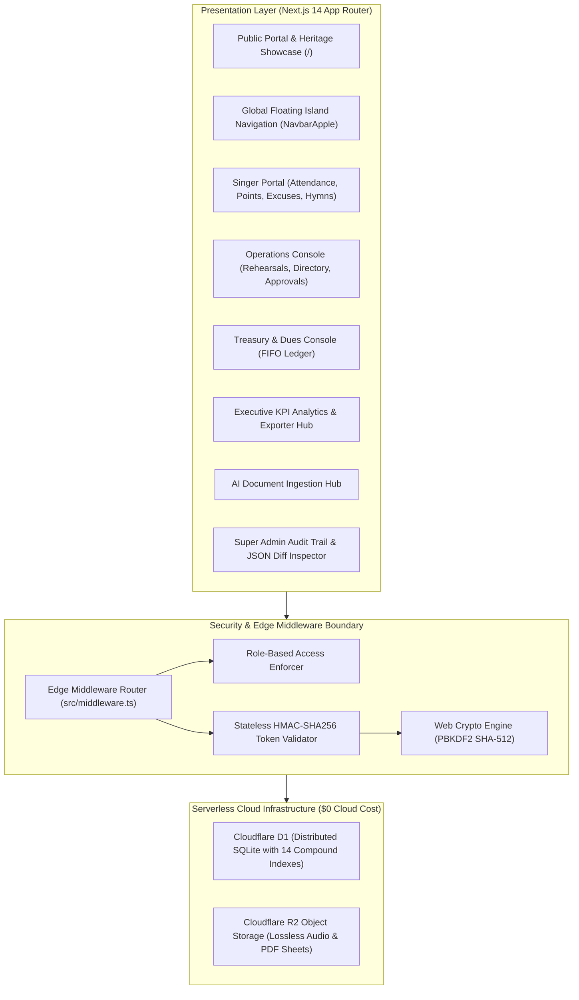

<div align="center">

# ⛪ Thamar Shefah Choir Management System
### Coptic Orthodox Diocese of Sohag — St. George Church
**Sacrifice of Praise • Established 2000 | ذبيحة تسبيح • تأسس عام 2000**

[](https://nextjs.org/)
[](https://www.typescriptlang.org/)
[](https://tailwindcss.com/)
[](https://developers.cloudflare.com/d1/)
[](https://developers.cloudflare.com/r2/)
[](https://developer.mozilla.org/en-US/docs/Web/API/Web_Crypto_API)
[](LICENSE)

<p align="center">
  An enterprise-grade, edge-native ecclesiastical operations platform engineered for <strong>Thamar Shefah Choir</strong> at St. George Church — Diocese of Sohag.<br/>
  Orchestrates server-authoritative GPS geofenced attendance, points ledger wallets, deterministic FIFO dues treasury, sacred media streaming via Cloudflare R2, AI-assisted document ingestion, and executive KPI intelligence — operating with <strong>$0/month cloud infrastructure overhead</strong> on the Cloudflare Serverless Free Tier.
</p>

[System Architecture](#-system-architecture) • [Core Subsystems](#-core-subsystems) • [Security & Privacy](#-security--data-privacy) • [Role-Based Access Control](#-role-based-access-control-rbac) • [Local Development](#-local-development--setup) • [Cloud Deployment](#-production-edge-deployment)

---

</div>

## 🎨 Visual Identity & Liturgical Design System

The system's visual identity is crafted in accordance with the official choir emblem and liturgical heritage, following high-contrast, accessible `ui-ux-pro-max` design tokens:

| Token | Hex Value | Application & Liturgical Context |
|:---|:---:|:---|
| **Imperial Burgundy** | `#640810` | Primary brand identifier, ecclesiastical calligraphy, primary actions, and hero emphasis. |
| **Radiant Gold** | `#DCA40C` | Harp strings, cross emblem, KPI achievement badges, focus rings, and active state indicators. |
| **Warm Ivory** | `#FDFBF7` | Ergonomic background canvas engineered for optimal contrast in dim church lighting environments. |
| **Translucent Glass** | `#FFFFFF` | Frosted glass cards (`backdrop-blur-md`) with subtle gilded borders (`#EADBB6`). |

---

## 🏗️ System Architecture

The platform follows a modern Edge-First architecture deployed on Cloudflare Pages and Workers with zero server management overhead:



---

## 🌟 Core Subsystems

### 1. 🧭 Apple Dynamic Island Global Navigation
- Omnipresent floating glass capsule providing continuous, frictionless orientation across all desktop and mobile routes.
- **Computed Parent Navigation:** Dynamically resolves the contextual parent route with one click, eliminating circular back-button loops.
- Instant, layout-stable bilingual toggle (**Arabic RTL** $\leftrightarrow$ **English LTR**).

### 2. 📍 Server-Authoritative Haversine GPS Geofencing
- Verifies attendance strictly on the server using spherical trigonometry:
  $$\text{distance} = 2r \arcsin\left(\sqrt{\sin^2\left(\frac{\Delta \phi}{2}\right) + \cos(\phi_1)\cos(\phi_2)\sin^2\left(\frac{\Delta \lambda}{2}\right)}\right)$$
- Enforces a rigorous **100-meter radius geofence** around consecrated church premises during designated rehearsal windows.
- Automated multi-tier arrival classification:
  - `PRESENT` — On-time arrival within the designated grace window 🟢
  - `LATE` — Moderate arrival delay 🟡
  - `VERY_LATE` — Extended delay 🟠
  - `EXTREME_LATE` — Critical delay threshold 🔴
  - `ABSENT` — Unexcused absence

### 3. 📨 Excuse Triage & Precedence Engine
- Singer self-service submission for anticipated full absences or specific arrival delay windows.
- Real-time conductor review inbox with atomic status synchronization.
- Approved excuses automatically update rehearsal logs to `EXCUSED_ABSENCE` and prevent unexcused penalty deductions.

### 4. 🏆 Dynamic Points Ledger & Wallet
- Occurrence-based escalating penalty matrix calibrated quarterly (e.g., initial delay vs. habitual infractions).
- Real-time digital balance computation powered by an immutable transactional ledger (`point_transactions`).
- Formalized supervisor audit interface for documented awards, liturgical honors, and administrative adjustments.

### 5. 💰 Deterministic FIFO Dues Treasury
- Automated recurring billing engine segmented by member classification (`STUDENT` vs. `WORKING`).
- **Deterministic First-In, First-Out (FIFO) Debt Retirement:** Incoming payments automatically resolve the oldest outstanding dues first, preventing cumulative debt delinquency.
- Granular collection rosters, financial waiver authorizations, and audit-ready cash logs.

### 6. 🎼 Sacred Hymn Repository & Lossless Edge Streaming
- Retains **original audio file extensions** (`.mp3`, `.wav`, `.m4a`, `.aac`, `.flac`) and high-resolution PDF scores.
- Implements `HTTP 206 Partial Content` edge byte-range requests for instantaneous audio seeking without data waste.
- Multi-speed practice player (`0.75x`, `1.0x`, `1.25x`), integrated PDF sheet music viewer, and SATB vocal part guides.
- Liturgical categorization covering ecclesiastical seasons, feasts, and the specialized **"Cantata" (كنتاتا)** repertoire.

### 7. 📊 Executive Analytics & Multi-Level KPIs
- **Choir Health Index (/100):** Weighted multi-variable composite score evaluating attendance promptness, vocal stability, and treasury health.
- **Individual Singer Metrics:** Active commitment streak tracking (🔥), vocal section quartile ranking, and tier assignments (*Elite*, *Exemplary*, *Consistent*, *At Risk*).
- **Interactive Singer Report Cards:** Formatted personal achievement summaries exportable for individual pastoral follow-up.

### 8. 📄 Multi-Format Report Exporter
- **Excel (`.xlsx`):** Multi-sheet analytical workbook featuring executive summaries, member attendance tables, and vocal distribution metrics.
- **Word (`.docx`):** Official ecclesiastical memorandum complete with church letterhead, KPI summaries, and formal signature blocks for the Parish Priest, Maestro, and General Supervisor.
- **Print / PDF:** Optimized high-dpi stylesheets with clean pagination and margin control.

### 9. 🤖 AI Document Ingestion & Roster Scheduler
- Ingests roster spreadsheets, rehearsal plans, and hymn inventories via drag-and-drop (`.xlsx`, `.xls`, `.docx`, `.pdf`).
- Hybrid processing engine (Google Gemini API with an offline Arabic linguistic heuristic fallback) that extracts and normalizes:
  - 👥 Singers, phone records, and vocal sections (Soprano, Alto, Tenor, Bass).
  - 📅 Rehearsal dates, schedules, and location coordinates.
  - 🎵 Hymns, liturgical categories, lyrics, and metadata.
  - 💰 Historical subscription contributions.
- Interactive side-by-side reconciliation interface with a **1-Click Atomic Commit**.

### 10. 🛡️ Tamper-Evident Super Admin Audit Trail
- Route-level security barrier on `/admin/super/*` restricted strictly to `SUPER_ADMIN`.
- Immutable append-only audit log recording actor identity, action type, entity references, and timestamps.
- **Side-by-side JSON Diff Inspector** visualizing exact attribute changes before and after each administrative action.

---

## 🔒 Security & Data Privacy

Security and data integrity are engineered into every layer of the platform:

```
┌────────────────────────────────────────────────────────────────────────┐
│                        SECURITY & COMPLIANCE                           │
├──────────────────────────┬─────────────────────────────────────────────┤
│ Password Hashing         │ PBKDF2 (SHA-512, 100,000 iterations, salt)  │
│ Session Architecture     │ Stateless HMAC-SHA256 Token (HttpOnly, SSL) │
│ Location Privacy         │ Zero GPS persistence; server-evaluated only │
│ Anti-Bot Protection      │ Cloudflare Turnstile integration            │
│ Authorization Model      │ Multi-layer RBAC (Edge Middleware + API)    │
│ Audit Immutability       │ Append-only audit ledger with JSON diffs    │
└──────────────────────────┴─────────────────────────────────────────────┘
```

- **Zero GPS Persistence:** Member coordinates are processed exclusively in-memory for Haversine verification and discarded immediately. Raw coordinates are never stored in database records or broadcast over network channels.
- **Secure Token Cryptography:** Built upon the Web Crypto API standards for full compatibility with Cloudflare Edge Workers and standard Node.js runtimes.

---

## 👥 Role-Based Access Control (RBAC)

The system defines four standardized, non-overlapping roles:

| Role | Identifier | Privileges & Scope |
|:---|:---:|:---|
| **Member** | `MEMBER` | GPS check-in, points wallet review, excuse submission, hymn playback & score viewing, dues history. |
| **Operations Admin** | `ADMIN` | Rehearsal scheduling, geofence calibration, excuse approval inbox, member onboarding, hymn catalog management. |
| **Treasury Officer** | `SUBSCRIPTION_MANAGER` | Recurring dues generation, cash collection logging, FIFO payment reconciliation, and dues waivers. |
| **Super Admin** | `SUPER_ADMIN` | Global governance: Role provisioning/revocation, security audit trail inspection, and JSON diff forensic analysis. |

---

## 🗺️ 10-Phase Project Roadmap

- [x] **Phase 1: Foundation & Liturgical Identity** — Design system tokens, responsive landing portal, and interactive simulator.
- [x] **Phase 2: Authentication & Approval Gate** — Web Crypto PBKDF2 engine, RBAC, and member onboarding barrier.
- [x] **Phase 3: Directory & Vocal Sections** — Member roster, annual quarter partitions, and SATB voice assignments.
- [x] **Phase 4: GPS Attendance Engine** — Server-authoritative Haversine engine, geofencing, and multi-tier arrival timing.
- [x] **Phase 5: Excuse Triage & Inbox** — Self-service excuse submissions, precedence evaluation, and administrative approval workflow.
- [x] **Phase 6: Points Ledger & Wallet** — Quarterly occurrence tiers, real-time balance calculations, and documented manual adjustments.
- [x] **Phase 7: Treasury & FIFO Subscriptions** — Automated monthly dues generator, FIFO debt allocation, and treasury reports.
- [x] **Phase 8: Hymn Library & Media Streaming** — Cloudflare R2 audio streaming, original format preservation, and PDF sheet viewer.
- [x] **Phase 9: Analytics, AI Ingestion & Audit** — Executive KPIs, multi-format Word/Excel/PDF exports, AI ingestion hub, and audit diff inspector.
- [ ] **Phase 10: Production Verification & Cloud Launch** — Final ecclesiastical copy audit, end-to-end integration test suite, and Cloudflare production release.

---

## 💻 Local Development & Setup

### Prerequisites
- [Node.js](https://nodejs.org/) (v18.17+ or v20+ LTS recommended)
- `npm` (v9+)

### Installation
```bash
# 1. Clone the repository
git clone https://github.com/FadyAmgadNaoum/ThamarShefahChoir.git
cd ThamarShefahChoir

# 2. Install dependencies
npm install

# 3. Configure environment variables
cp .env.example .env.local
```

### Environment Configuration (`.env.local`)
Configure the required settings in `.env.local` using secure, non-default values:
```env
# Database connection (SQLite locally; Cloudflare D1 in production)
DATABASE_URL="file:local.db"

# Session cryptographic secret (generate with: openssl rand -base64 32)
AUTH_SECRET="your-32-character-random-secret-key-here"

# Google Gemini API key (optional: system includes an offline heuristic engine)
GEMINI_API_KEY=""

# Initial Administrator Seed (optional for first-run bootstrap)
INITIAL_ADMIN_EMAIL="admin@thamar-shefah.org"
INITIAL_ADMIN_PASSWORD="YourSecurePasswordHere"
```

### Run the Development Server
```bash
npm run dev
```
Open **`http://localhost:3000`** in your browser to view the application.

---

## ☁️ Production Edge Deployment

The application is engineered to deploy seamlessly to the **Cloudflare Serverless Ecosystem**, operating entirely within the **Free Tier**:

- **Cloudflare D1:** Serverless SQLite database with global read replication (up to 5 million reads/day at no cost).
- **Cloudflare R2:** High-throughput object storage with **Zero Egress Fees** for lossless media delivery.
- **Cloudflare Pages / Workers:** Ultra-low latency edge compute serving Next.js across Egypt and global edge nodes.

### Deployment Workflow
```bash
# 1. Authenticate with Cloudflare CLI
npx wrangler login

# 2. Execute database migrations on remote Cloudflare D1
npx wrangler d1 migrations apply thamar-shefah-db --remote

# 3. Build and deploy edge bundle
npm run build
npx wrangler deploy
```

---

<div align="center">

**"I will sing to the Lord as long as I live; I will sing praise to my God while I have my being." (Psalm 104:33)**<br/>
*St. George Coptic Orthodox Church — Diocese of Sohag*

</div>
